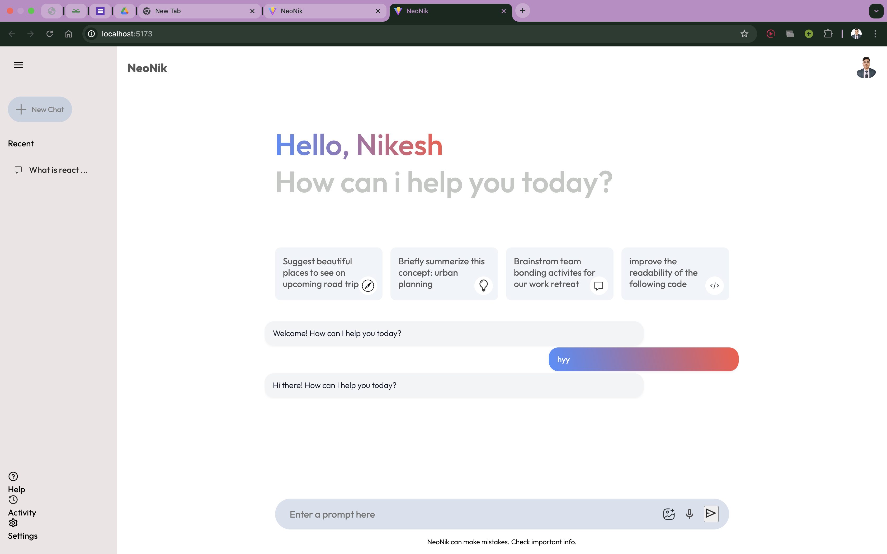

# 🤖 NeoNik Chat Bot

NeoNik is an advanced conversational AI chatbot inspired by **Gemini AI**, developed to provide intelligent, contextual, and interactive conversations. It leverages modern UI design and smart response patterns to simulate a seamless human-like assistant.

---

## 🚀 Features

- 🌐 Real-time conversational AI
- 📄 Multi-turn context understanding
- 🎨 Gemini-inspired clean and modern UI
- 🧠 Intelligent response generation using large language models
- ☁️ Easy deployment
- 🧩 Modular codebase for easy customization and scaling

---

## 📸 Preview
> Sample: 
> 

---

## 🛠️ Tech Stack

| Technology      | Use                                |
|----------------|-------------------------------------|
| React.js        | Frontend UI                        |
| Tailwind CSS    | Styling                             |
| Node.js / Express | Backend API (if applicable)     |
| OpenAI / Gemini API | AI Model / LLM Integration      |
| Firebase / Supabase | (Optional) Auth & Database     |

---

## 📂 Project Structure

neoNik/
├── client/ # Frontend - React
│ ├── components/
│ ├── pages/
│ └── App.js
├── server/ # Backend (Optional)
│ └── index.js
├── .env
└── README.md
---

## ⚙️ Getting Started

### 1. Clone the Repository

```bash
git clone https://github.com/Nikesh-12215759/NeoNik.git
cd NeoNik
```
### 2. Install Dependencies in both frontend and backend
```bash
npm install      # or yarn
```
### 3.Add Environment Variables
Create a .env file and add:
```bash
REACT_APP_OPENAI_API_KEY=your_api_key_here
```
Replace with your OpenAI or Gemini API key.

###4. Run the backend
```bash
cd backend
node index.js
```
###5. Run the frontend
```bash
cd frontend
npm run dev
```
###👨‍💻 Author

```
Made with ❤️ by Nikesh Sahoo


